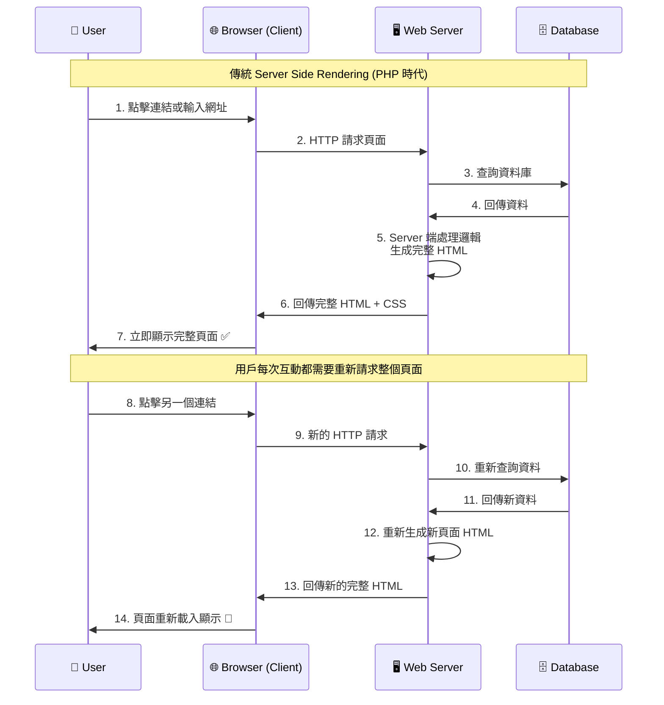
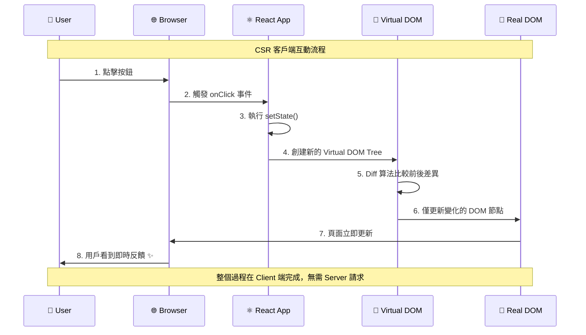
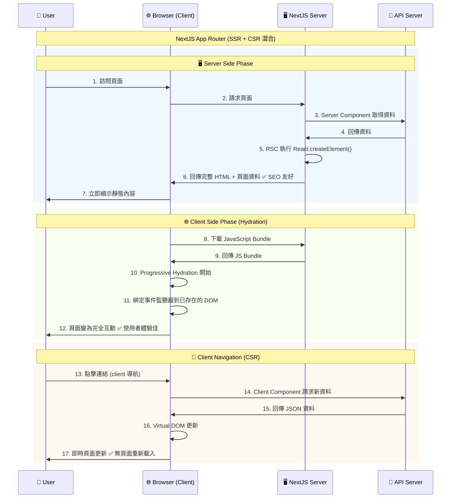
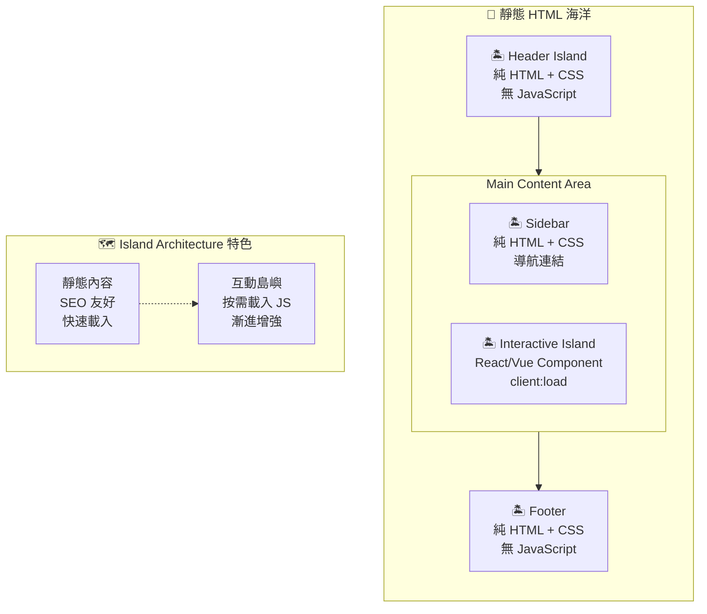

# 【Astro】伺服器渲染策略與 Island Architecture

## 前言

在使用一個技術之前，最重要的是去了解這個技術的背景，以及這個技術的優缺點。但偏偏如 Next.js 或是 Astro 等框架解釋 Hydration 或是 SSR 的時候，牽涉到 Server 端、Client 端的互動，同時有很多抽象的名詞。因此想要寫一篇清楚的筆記，來研究這些框架的設計理念。

## 前端框架的困境

> 雖然有點繞口，不過前面還是要補充一點， Next.js 或是 Astro 等框架出現的背景。

### 傳統服務端渲染時代

#### SSR 傳統服務端渲染流程



- **PHP & 模板引擎**：依靠 server 端輸出完整的 HTML 結構
- **優點**：SEO 友好，首次載入即可看到完整內容
- **缺點**：使用者體驗較慢，每次互動都需要等待 Server 端重新渲染，缺乏現代 Web 應用的流暢性

### 客戶端渲染時代

#### 什麼是 Virtual DOM？

React 的本質是透過 `React.createElement` 來建立虛擬的 DOM 結構，並且透過 `ReactDOM.render` 比較前後兩個虛擬 DOM 的差異，來渲染到 DOM 上，而這件事情是在 Client 端執行。

```javascript
// 建立一個 div 元素，並且在裡面放上 "Hello World" 文字
React.createElement("div", null, "Hello World");
```

```html
// 在 index.html 中，會有一個 id 為 root 的 div 元素，並讓 React 接管這個元素的
DOM 操作

<!DOCTYPE html>
<html lang="zh-TW">
  <head>
    <meta charset="UTF-8" />
    <meta name="viewport" content="width=device-width" />
  </head>
  <body>
    <!-- React 接管的根元素 -->
    <div id="root"></div>
  </body>
</html>
```

#### CSR 客戶端互動範例



- **React 等 SPA 框架**：使用 Virtual DOM 來管理 DOM 操作，提供更流暢的使用者互動體驗
- **優點**：使用者可以更快速得到反饋，無需頁面重新載入，提供類似原生應用的體驗
- **缺點**：
  - Virtual DOM 不利於 SEO，搜索引擎爬蟲難以解析 JavaScript 生成的內容
  - 首次載入時間較長，需要下載並執行 JavaScript 才能看到內容
  - 對於低效能設備或網路環境較差的使用者體驗不佳

### 現代解決方案：Hydration & SSR

> 根據 [And Now You Understand React Server Components | Kent C. Dodds](https://www.youtube.com/watch?v=pOo7x8OiAec&list=PLNG_1j3cPCaapCRvpsyQ2CrNtnTtLf2jz&index=17) 的說法，RSC 的本質就是提前在 Server 端執行 `React.createElement()` 的方法，並提前完整產生 HTML（ Hydration ），這樣 SEO 就能解析到`<div id="root"/>` 底下完整的內容。

- **核心概念**：就像「脫水」與「補水」的過程
  1. **Server 端**：預先產生完整的 HTML 結構（脫水狀態）
  2. **Client 端**：瀏覽器載入 JavaScript 後重新綁定事件監聽器和互動邏輯（補水過程）
- **優勢結合**：
  - 保持 SEO 友好性（完整的 HTML 結構）
  - 提供快速的首次內容呈現（First Contentful Paint）
  - 維持現代 Web 應用的互動體驗

#### 前端渲染策略比較表

> 同時根據資料的新鮮度，也會採取不同的渲染策略。

| 項目             | ISR              | SSG            | SSR                    | CSR                    |
| ---------------- | ---------------- | -------------- | ---------------------- | ---------------------- |
| **資料更新頻率** | 中頻率更新       | 低頻率更新     | 高頻率更新             | 即時更新               |
| **首次載入速度** | 極快             | 極快           | 快                     | 慢                     |
| **SEO 友好度**   | 優秀             | 優秀           | 優秀                   | 差                     |
| **伺服器負載**   | 低               | 極低           | 高                     | 極低                   |
| **適用情境**     | 部落格、商品頁面 | 文檔、行銷頁面 | 社交媒體、即時數據     | 管理後台、互動應用     |
| **代表框架**     | Next.js ISR      | Gatsby、Astro  | React Server Component | React Client Component |

## Astro vs Next.js

### Next.js

> NextJS 是基於 RSC (React Server Component) 的概念，來實現 Progressive Hydration、`<Suspense>` 實現 Partial Hydration。

- [【NextJS】Server and Client Components](https://nextjs.org/docs/app/getting-started/server-and-client-components)
- [【GitHub】New Suspense SSR Architecture in React 18](https://github.com/reactwg/react-18/discussions/37)

💡 Progressive Hydration: 基於時間、優先級或使用者行為，逐步水合整個應用程式。

💡 Partial Hydration: 只水合頁面中需要互動的特定部分，其餘保持靜態。

#### NextJS 的 SSR + CSR 混合架構



```jsx
// Server Side Component (預設)
async function ServerComponent() {
  const data = await fetch("api/data"); // 在 Server 端執行
  return <div>{data}</div>; // HTML 直接生成
}

// Client Side Component (需要 "use client" 指令)
("use client");
function ClientComponent() {
  const [count, setCount] = useState(0); // 在 Client 端執行
  return <button onClick={() => setCount(count + 1)}>{count}</button>;
}
```

### Astro

> [Island Architecture](https://jasonformat.com/islands-architecture/) (Partial Hydration): 本質上與 Progressive Hydration 的處理方式是類似的，但差別是 Island Architecture 將元素拆成獨立的 HTML 片段，並在必要的時候使用 JavaScript 來處理互動。

💡 Partial Hydration: 只水合頁面中需要互動的特定部分，其餘保持靜態。

#### Astro 的 Island Architecture



```astro
---
// 僅在需要的時候使用 Javascript 程式碼
---

<div>
  <h1>Hello World</h1>
  <p>This is a paragraph</p>
</div>

<MyReactComponent client:load />
```

## TD;LR
