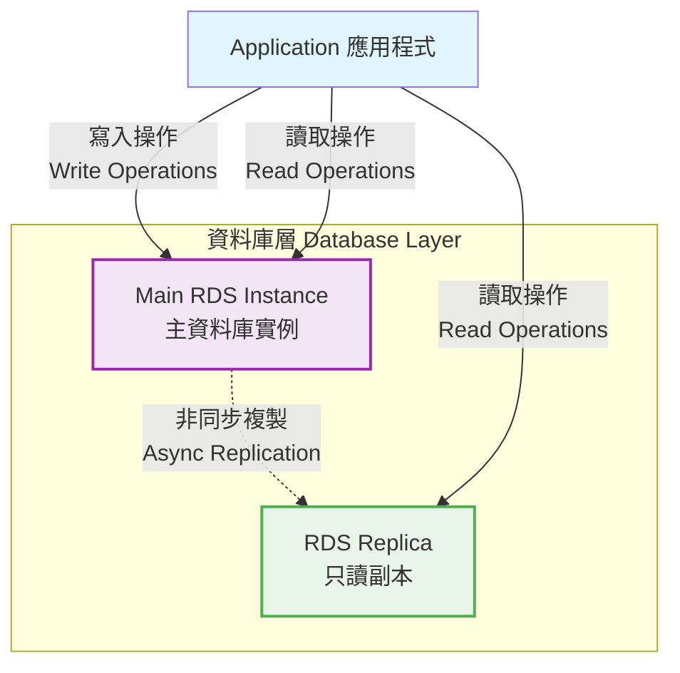
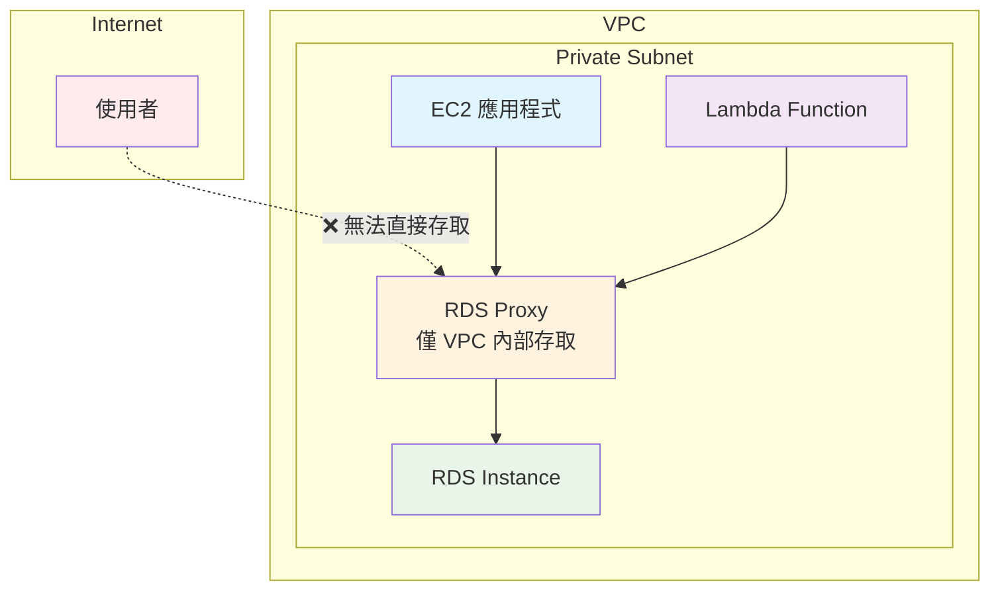
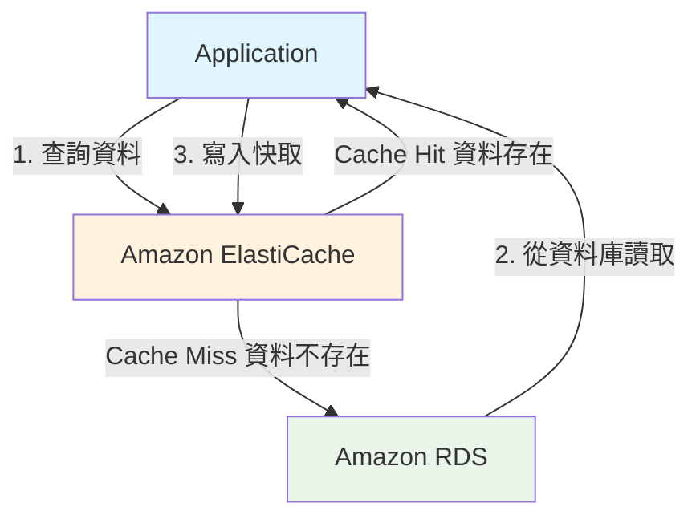

# AWS RDS

## 一、什麼是 RDS？

RDS 是 Amazon Relational Database Service 的縮寫，是 AWS 提供的關係型資料庫服務。

### RDS Replica

- 非同步複製，主資料庫實例的資料會非同步複製到只讀副本。

### RDS Multi AZ (Disaster Recovery)

## 二、什麼是 Aurora？

Aurora 是 AWS 提供的關係型資料庫服務，是 RDS 的升級版。

- PostegreSQL / MySQL 相容

## RDS & Aurora 安全性（Security）

- In-flight encryption: 在傳輸過程中加密。
- IAM authentication: 使用 IAM 認證來連接 RDS 和 Aurora。
- Security Groups: 允許特定的 IP 地址或安全組來連接 RDS 和 Aurora。
- Addit Log: 可以將 RDS 和 Aurora 的日誌發送到 CloudWatch Logs。

## RDS Proxy

## ElastiCache

> Amazon ElastiCache 是一種完全受管的記憶體內快取服務 (in-memory cache service)。它旨在幫助你顯著提高 Web 應用程式的效能，透過允許你在高速的記憶體內快取中檢索資訊，而不是每次都依賴較慢的磁碟式資料庫。

## Cache 策略比較

| 特性 / 策略 | Lazy Loading (Cache-Aside)             | Write-through                                       | TTL                                                      |
| ----------- | -------------------------------------- | --------------------------------------------------- | -------------------------------------------------------- |
| 讀取        | 優先查快取，未命中則查 DB 並回填快取。 | 優先查快取，快取中始終有最新資料。                  | 設定資料過期時間，到期則失效，下次讀取時從 DB 重新載入。 |
| 寫入        | 先寫 DB，再使快取失效或更新。          | 同時寫入快取和 DB。                                 | 獨立於寫入策略，管理資料「新鮮度」。                     |
| 一致性      | 最終一致性，寫入後短暫不一致風險。     | 強一致性，快取與 DB 寫入同步。                      | 確保快取資料不會無限期陳舊，降低不一致風險。             |
| 延遲        | 首次讀取有延遲，寫入延遲低。           | 寫入延遲高，讀取延遲低。                            | 影響快取命中率，進而影響讀取延遲。                       |
| 快取利用    | 僅快取「熱門」數據，利用率高。         | 可能快取「冷門」數據，利用率可能低於 Lazy Loading。 | 定期清除舊數據，有助於高效利用快取空間。                 |
| 複雜度      | 實現相對簡單。                         | 實現相對簡單，但需處理雙重寫入失敗。                | 需配合讀寫策略使用，設定合適的過期時間是關鍵。           |

- 如果資料更新很慢、只需要記住簡單的 key-value pair => Cache

### Lazy Loading

### Write Through: 當資料更新時，同時更新快取。

### Cache Evictions and Time to Live (TTL)

> 當快取空間不足時，快取系統需要決定移除（或「驅逐」）哪些現有資料，以便為新進入的資料騰出空間的過程。

- 當快取滿了，需要刪除一些資料。
- 可以設定 TTL，當資料過期後，自動刪除。
