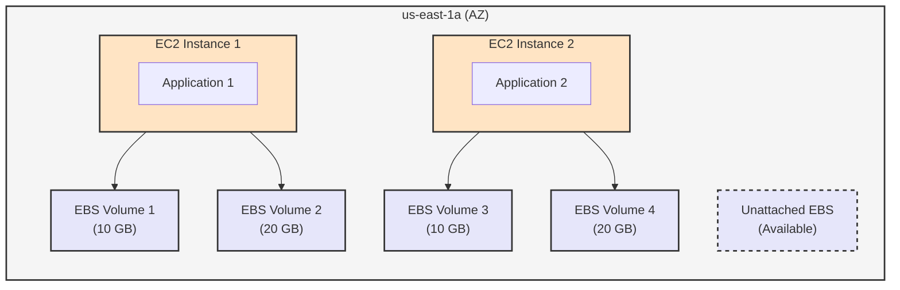

:::note
這邊是《Ultimate AWS Certified Developer Associate 2025 DVA-C02》的讀書筆記。
:::

# 什麼是 EBS Volume？

> EBS Volume 是一種可以掛載到 EC2 instance 的 block storage，類似於硬碟。即便 EC2 關閉了，EBS Volume 仍然會保留資料（persist data）。

## Features

- Network drive
  - 他使用網路來連接到 EC2 instance
  - 可以隨時 detach 並 attach 到其他 instance
- 鎖定在可用區域（Availability Zone）
  - EBS Volume 是跟著可用區域走的
  - 一個 EBS Volume 只能掛載到一個 instance
- Have a provisioned capacity
  - 需要指定容量大小
  - 一旦指定，就無法縮小容量，只能增加

