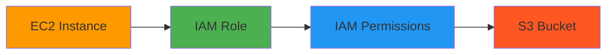
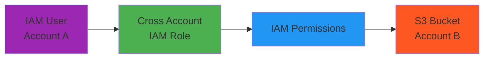

## 一、什麼是 S3 Bucket？


- Bucket: Amason S3 allow people to store objects (files) in a bucket(directory)
- S3 Bucket has 99.99 % Availbility

- Object: 由一組 Key 組成
  - key is the FULL path
  - prefix + object name
    - s3://my-bucket/my-folder/my-file.txt
  - 容量上限：5TB

## 二、安全性配置

> 詳細可以透過 [Policy Generator](https://awspolicygen.s3.amazonaws.com/policygen.html) 來生成。

#### 權限配置類型

- User Based：IAM Policy 是附加到 AWS Identity and Access Management (IAM) 實體 (例如：IAM 使用者、IAM 角色或 IAM 群組) 上的權限政策。

```json
{
  "Version": "2012-10-17",
  "Statement": [
    {
      "Sid": "AllowListBucket",
      "Effect": "Allow",
      "Principal": {
        "AWS": "arn:aws:iam::ACCOUNT-ID:user/USERNAME"
      },
      "Action": "s3:ListBucket",
      "Resource": "arn:aws:s3:::my-bucket",
      "Condition": {
        "IpAddress": {
          "aws:SourceIp": "203.0.113.0/24"
        }
      }
    },
    {
      "Sid": "AllowObjectOperations",
      "Effect": "Allow",
      "Principal": {
        "AWS": "arn:aws:iam::ACCOUNT-ID:user/USERNAME" // 限制特定 IAM 用戶
      },
      "Action": ["s3:GetObject", "s3:PutObject", "s3:DeleteObject"],
      "Resource": "arn:aws:s3:::my-bucket/*",
      "Condition": {
        "IpAddress": {
          "aws:SourceIp": "203.0.113.0/24"
        }
      }
    }
  ]
}
```

- Resource-Based：是直接附加到 S3 儲存貯體本身的 JSON 格式政策。它定義了「哪些人」可以對「這個特定的儲存貯體」執行「哪些動作」。

```json
{
  "Version": "2012-10-17",
  "Statement": [
    {
      "Effect": "Allow",
      "Principal": "*",
      "Action": "s3:GetObject",
      "Resource": "arn:aws:s3:::my-bucket/*"
    }
  ]
}
```

#### 權限說明

| Action            | 用途             | 說明                      |
| ----------------- | ---------------- | ------------------------- |
| `s3:ListBucket`   | 📂 列出檔案      | 查看 bucket 內的物件列表  |
| `s3:GetObject`    | 📥 讀取檔案      | 下載/讀取 bucket 內的物件 |
| `s3:PutObject`    | 📤 上傳/修改檔案 | 上傳新檔案或覆蓋現有檔案  |
| `s3:DeleteObject` | 🗑️ 刪除檔案      | 刪除 bucket 內的物件      |

- Object Access Control List (ACL)
- Bucket Access Control List (ACL)

#### 範例

1. EC2 存取 S3 Bucket



2. Cross Account Access



#### 權限配置差異說明

| 項目           | EC2 存取 S3                      | Cross Account Access                    |
| -------------- | -------------------------------- | --------------------------------------- |
| **使用情境**   | 同一 AWS 帳戶內的服務間存取      | 不同 AWS 帳戶間的資源存取               |
| **身份驗證**   | EC2 Instance 透過附加的 IAM Role | 外部帳戶的 IAM User 透過 AssumeRole     |
| **信任關係**   | EC2 服務自動信任                 | 需要明確設定 Cross Account Trust Policy |
| **安全性考量** | 相對簡單，內部網路存取           | 需要更嚴格的權限控制和審計              |
| **設定複雜度** | 低 - 只需設定 IAM Role 和 Policy | 高 - 需要設定信任關係和跨帳戶權限       |

## 三、版本（Versioning）

> 版本控制可以幫助我們在刪除物件時，保留歷史版本。

例如我重新上傳 `index.html` 後，會出現兩個版本 id。

```txt
| Name | Version | Last Modified |
|------|---------|---------------|
| index.html | null | 2025-01-01 12:00:00 |
| index.html | 123 | 2025-01-01 12:00:01 | <-- 可以刪除回滾到舊版本
| coffee.png | null | 2025-01-01 12:00:02 |
```

## 四、備份（Replication）

- CRR（Cross Region Replication）：跨區域備份
- SRR（Same Region Replication）：同區域備份

## 五、儲存類別（Store class）

> 跟據使用頻率來決定儲存類別，例如：

1.  Glacier Bucket Class：

> Glacier 儲存類別主要用於長期儲存不常存取但需要保留的資料，例如：

- 備份和災難恢復資料
- 法規遵循要求的資料歸檔
- 舊的媒體檔案
- 科學研究資料

2. Infrequent access

> 「Infrequent Access Class」指的是針對不常存取但需要快速取用的資料所設計的儲存類別

- 長期備份資料： 雖然是備份，但你可能很少需要從中恢復資料。
- 災難復原資料： 只有在發生災難時才會用到，但那時又要求立即可用。
- 舊的專案檔案或報告： 偶爾需要查閱，但大部分時間都閒置著。

## 六、實際使用情境

### 使用情境 1：使用 Bucket 存取圖片

#### 1. 建立一個 S3 Bucket


#### 2. 設定 Bucket 的存取權限（Security Policy）

```json
{
  "Version": "2012-10-17",
  "Statement": [
    {
      "Sid": "AllowListBucket",
      "Effect": "Allow",
      "Principal": "*",
      "Action": "s3:ListBucket",
      "Resource": "arn:aws:s3:::YOUR_BUCKET_NAME_HERE"
    },
    {
      "Sid": "AllowObjectOperations",
      "Effect": "Allow",
      "Principal": "*",
      "Action": ["s3:GetObject"],
      "Resource": "arn:aws:s3:::YOUR_BUCKET_NAME_HERE/*"
    }
  ]
}
```

#### 3. NextJS：API Route 建立 pre-signed url 的呼叫方法

> Pre-signed URL 是 AWS 提供的一種方式，可以驗證這個請求是來自特定的 IAM User。

```tsx
// /api/s3/get-presigned-url.ts

import { S3Client, GetObjectCommand } from "@aws-sdk/client-s3";
import { getSignedUrl } from "@aws-sdk/s3-request-presigner";

const s3 = new S3Client({
  region: "us-east-1",
});

export async function GET(request: Request) {
  const { searchParams } = new URL(request.url);
  const key = searchParams.get("key");

  const command = new GetObjectCommand({
    Bucket: "my-bucket",
    Key: key,
  });

  const url = await getSignedUrl(s3, command, {
    expiresIn: 60 * 60 * 24, // 1 day
  });

  return NextResponse.json({ url });
}
```

客戶端請求範例：

```txt
GET /api/s3/get-presigned-url?key={YOUR_OBJECT_KEY}
GET /api/s3/get-presigned-url?key=my-folder/my-file.txt
```

預期回傳資源連結，例如可以 `` 來存取該資源。

```json
{
  "url": "https://my-bucket.s3.amazonaws.com/my-folder/my-file.txt"
}
```

### 使用情境 2：部署靜態網站（Static Website）


1. 建立一個 S3 Bucket
2. 設定 Bucket 的存取權限（Security Policy）
3. 設定 Bucket 的靜態網站（Static Website Hosting）

YOUR_BUCKET > 屬性（Properties） > 選擇 靜態網站（Static Website Hosting）

### 使用情境 3：整合既有服務

> 這邊就不贅述，僅提供過去整合過的服務案例，通常可以在 Storage 相關的 configuration 章節找到配置選項。

- [【Strapi CMS】How to Set up Amazon S3 Upload Provider Plugin for Your Strapi App](https://strapi.io/blog/how-to-set-up-amazon-s3-upload-provider-plugin-for-our-strapi-app)
- [【Outline】 File storage](https://docs.getoutline.com/s/hosting/doc/file-storage-N4M0T6Ypu7)

## 七、參考資料

1. [Examples of Amazon S3 bucket policies](https://docs.aws.amazon.com/AmazonS3/latest/userguide/example-bucket-policies.html)

2. [AWS Policy Generator](https://awspolicygen.s3.amazonaws.com/policygen.html)
