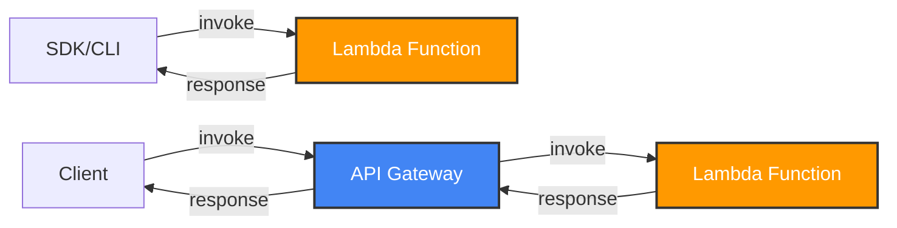
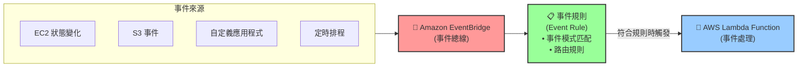

# Lambda 簡介

## Serverless 是什麼

> Serverless 是一種雲端運算模型，它允許開發者編寫程式碼，而不需要管理伺服器。

### Lambda vs EC2

| 特性     | EC2                                 | Lambda                               |
| -------- | ----------------------------------- | ------------------------------------ |
| 運算單位 | 虛擬伺服器 (Virtual Server)         | 虛擬函數 (Virtual Function)          |
| 資源限制 | 受限於 RAM 和 CPU                   | 受限於執行時間（短時間）             |
| 執行方式 | 持續運行                            | 按需執行（On Demand）                |
| 擴展性   | 需手動介入新增/移除實例（Instance） | 自動擴展                             |
| 適用場景 | 長時間運行、需完整控制的應用        | 短時間、事件驅動、無伺服器管理的應用 |

## Lambda 應用情境

- S3 -- Create Thumbnail by Lambda -> S3 Bucket

- API Gateway

- SQS

- SNS

- BridgeEvent

- RDS

## Lambda 的非同步應用（Synchronous Invocation）

> Synchronous Invocation: 同步調用，客戶端等待 Lambda 函數的響應。



## Embedded Lambda as HTTP Handler

- 可以使用 ALB、API Gateway 等服務來調用 Lambda 函數。

### 使用 ALB 調用 Lambda 函數

```json
{
  "requestContext": {
    "elb": {
      "targetGroupArn": "arn:aws:elasticloadbalancing:us-east-1:123456789012:targetgroup/my-target-group/123456789012"
    },
    "httpMethod": "GET",
    "path": "/lambda",
    "queryStringParameters": {
      "name": "John"
    },
    "handler": {
      "connection": "keep-alive",
      "host": "lambda.us-east-1.amazonaws.com",
      "userAgent": "ELB-HealthChecker/2.0",
      "xForwardedFor": "127.0.0.1",
      "xForwardedPort": "443",
      "xForwardedProto": "https",
      "xForwardedHost": "lambda.us-east-1.amazonaws.com",
      "xForwardedPrefix": "/lambda",
      "xForwardedQueryString": "name=John",
      "xForwardedUri": "/lambda?name=John"
    }
  }
}
```

回應響應格式

```json
{
   "statusCode": 200,
   "body": "Hello, John!",
   "headers": {
      "Content-Type": "text/plain"
   },
   {
      "body": "<html><body>Hello, John!</body></html>",
      "isBase64Encoded": false
   }
}
```

## 事件監聽（Event Soucres Mapping）



> Lamdba 可以搭配 EventBridge、 SQS 監聽特定資源的排程，例如：

- AWS 服務事件：例如，是否有新的檔案上傳到 S3 Bucket、監聽 EC2 狀態
- 自定義事件：例如，使用 API Gateway 監聽特定事件
- 排程事件：類似於 Linux 的 cron job，可以設定定時觸發事件。

## Lamdba Layers：用來儲存依賴

## 安全性：VPC、IAM 設置

## 限制

- Execution
  - Memory allocation: 128MB - 10GB
  - Maximum execution time: 900 seconds(15 minutes)
  - Environment variables: 4KB
  - Disk cache: 512MB
  - Concurrency: 1000
- Deployment
  - Lambda function deploymnent package size: 50MB
  - Size of uncompressed deployment _code_ and _dependencies_: 250MB
  - Can use the `/tmp` directory to load other files at startup
  - Size of environment variables: 4KB

## Storqge

| 項目                                 | 用途                                             | 存取速度               | 資料持久性                   | 定價方式                      | 適合的場景                     |
| ------------------------------------ | ------------------------------------------------ | ---------------------- | ---------------------------- | ----------------------------- | ------------------------------ |
| **Ephemeral Storage**<br>(/tmp 空間) | Lambda 執行期間的暫存空間（最多可擴充到 10GB）   | 極快（本地磁碟）       | **不持久**（函式結束即清除） | 依申請大小與執行時間計費      | 暫存大型檔案、處理壓縮檔       |
| **Lambda Layers**                    | 共用程式碼、函式庫的機制，用來抽離通用依賴       | 快（隨 Lambda 初始化） | 與 Lambda 綁定期間有效       | 無額外費用，但部署大小受限    | 共用函式庫、第三方 SDK         |
| **Amazon S3**                        | 物件儲存服務，可供 Lambda 讀寫                   | 中等（透過 API）       | **持久**                     | 依存取頻率與儲存容量計費      | 存放輸入輸出資料、大型檔案備份 |
| **Amazon EFS**                       | 可掛載在 Lambda 上的檔案系統（支援多個函式共享） | 快（比 S3 快）         | **持久**                     | 依使用容量和 I/O 效能模式計費 | 需要共享狀態、模型、或大型檔案 |

## Lambda Concurrency Issue

- 如果沒有限制 Lambda 的並行數，可能會導致 Lambda 函數被過度使用，導致成本上升。

- 冷啟動 (Cold Start) 是指當 AWS Lambda 函數在一段時間沒有被調用後，第一次被調用時所需經歷的一個額外延遲。
