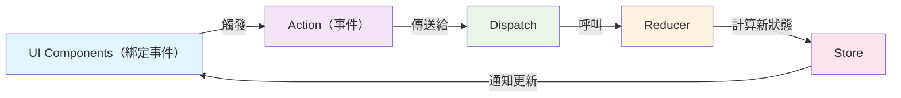
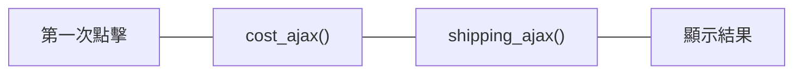
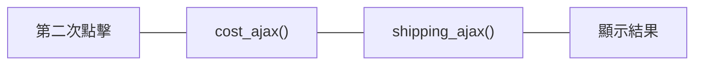
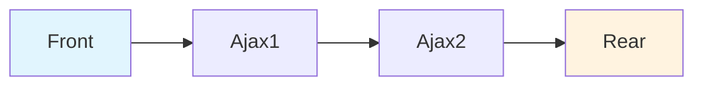

> 這篇文章主要是整理 CH16 ~ CH17 導讀簡報的內容，如果有興趣可以回過頭去參考我製作的[導讀簡報](https://chious.github.io/fp-intro-ch16-17/1) & [書籍原文](https://livebook.manning.com/book/grokking-simplicity/chapter-16#1)。

## 前言

業界有一迷因是：

『你覺得前端都在做什麼？』
『哦，切版、串接 API 哇～』

如果只能選擇一個答案，我可能會回答處理時間線、副作用的問題，更準確地來說是去處理上一偵跳到下一偵畫面的更新邏輯。不管是 React 或是 Android 的開發，如果要讓畫面『動起來』，都需要處理狀態（state）與 UI 的互動邏輯。



這個單向資料流確保了狀態變化的可預測性和除錯的便利性。

以購物車為例子：

```plaintext
初始UI（Loading中） -> fetchApi() -> 更新 State -> 更新 UI 畫面（商品資訊、運費）
```

但假如我們需要一次呼叫很多 API 呢？如果我們的使用者行為很複雜呢？通常 Bug 就會出現在這裡，或是點了 UI 後，沒有預期的結果。

### 簡單的例子：購物車商品誤植


對前端來說，通常只會處理到客戶端的操控行為（例如：輸入帳號密碼、點擊按鈕等等），如商品資訊、運費、折扣等需要呼叫 Server 取得的資料，然後再把資料呈現在畫面（DOM）上。假如目前我們有一購物車畫面，分別會呼叫兩組 API:

- `productAjax()`：一個產品預設是 100 元，計算後會回傳商品價格。
- `shippingAjax()`：運費預設是 50 元，計算後會回傳運費。

```js
let total = 0; // 全域變數來追蹤總金額

function updateToDOM(total) {
  // 更新 DOM 顯示總金額
  document.getElementById("total-price").textContent = `總計：$${total}`;
}

function productAjax(productId) {
  // 模擬 API 呼叫
  setTimeout(() => {
    let price = 100;
    total += price;
    updateToDOM(total); // UI 更新
    console.log(`商品價格：$${price}，目前總計：$${total}`);
  }, 1000);
}

function shippingAjax() {
  // 模擬 API 呼叫
  setTimeout(() => {
    let shipping = 50;
    total += shipping;
    updateToDOM(total);
    console.log(`運費：$${shipping}，目前總計：$${total}`);
  }, 1500);
}

function addToCart(productId) {
  total = 0; // 目前購物車的總金額
  updateToDOM(total); // 顯示初始狀態

  productAjax(productId);
  shippingAjax();
}
```

如果畫成流程圖會長這樣：





**問題出現了！** 如果第一次點擊的 Ajax 還沒完成，使用者又點擊第二次，會發生什麼事？

- 第一次的 `productAjax` 可能在第二次點擊後才回來，導致 total 計算錯誤
- DOM 會被多次更新，顯示不正確的金額
- 這就是典型的 **Race Condition（競態條件）** 問題

\*按編：為什麼不使用 `async`、`await()` 呢？因為 Function Programming 並不限於 Javascript，也可以在 Kotlin 等語言編譯。

## Concurrency Permitive

> Concurrency Primitives 是一組工具或機制，用於幫助開發者在並行程式中管理共享資源的存取，並協調不同執行緒或行程之間的行為。它們提供了一種方式來控制執行順序，避免競爭條件，並確保資料的一致性。

\*Concurrency：譯者翻譯成『併發』。

### 案例一：排隊（Queue）

> 最直白的解法是：如果執行先後順序在 JS 的執行結果不固定，我們不如就用客製化的方式：指定一件事情結束之後，才能執行下一件事情？



接著這是這個佇列要做的事情

1. 我們需要建立一個 Array 記憶目前正在處理的 tasks
2. 在這個 Array 中 push 新的 task 到陣列最後面
3. 如果執行結束，將這個任務踢除，重複整個流程直到陣列為空。

```js
function Queue() {
  var queue = []; // 1.記憶目前正在處理的 task
  var running = false;

  function run_next() {
    if (running) return; // 如果正在執行，直接返回
    if (queue.length === 0) return; // 如果佇列為空，直接返回

    running = true;
    var task = queue.shift(); // 取出第一個任務

    task(function () {
      running = false;
      run_next(); // 執行下一個任務
    });
  }

  return function (task) {
    queue.push(task); // 將任務加入佇列
    run_next(); // 嘗試執行任務
  };
}
```

#### 在購物車中使用 Queue

```js
// 建立一個購物車專用的佇列
var cartQueue = Queue();

function addToCartWithQueue(productId) {
  // 將整個購物車計算包裝成一個任務
  cartQueue(function (done) {
    total = 0; // 重置總金額
    updateToDOM(total);
    console.log("開始處理購物車計算...");

    // 使用 Cut 等待兩個 API 完成
    var cutDone = Cut(2, function () {
      console.log(`購物車計算完成，總計：$${total}`);
      updateToDOM(total);
      done(); // 告訴 Queue 這個任務完成了
    });

    productAjax(productId, cutDone);
    shippingAjax(cutDone);
  });
}

// 現在即使使用者快速點擊多次，也會按順序處理
addToCartWithQueue("product1"); // 第一次點擊
addToCartWithQueue("product2"); // 第二次點擊（會等第一次完成）
addToCartWithQueue("product3"); // 第三次點擊（會等前面都完成）
```

**Queue 的好處：**

- 確保購物車計算按照點擊順序執行
- 避免多次快速點擊造成的混亂
- 每個計算都會完整執行，不會被中斷

---

接著我們可能會處理一些比較極端的狀況，例如：

- 如果使用者 1 秒鐘點了 100 次按鈕，我們要怎麼處理？
- 以 Twitch 聊天室串流來說，如果遇到 Spammer（臭蟲）的話，我們要怎麼處理？ [Visualizing algorithms for rate limiting](https://smudge.ai/blog/ratelimit-algorithms)

### 案例二：等待（Cut）

> 你和朋友正在忙著不同的工作，但是你想一起吃午餐，如果約定『先完成的人等待後完成的人』，就可以保證無論誰先完成，最後都能一起吃午餐。

```js
function Cut(number, callback) {
  var num_finished = 0;
  return function () {
    num_finished++;
    if (num_finished === number) {
      callback();
    }
  };
}
```

#### 範例

> 接著讓我們套用到實際吃飯的例子：

```js
var done = Cut(3, function () {
  console.log("好誒！今天吃烤雞！");
});
done(); // 不會回傳
done(); // 不會回傳
done(); // 好誒！今天吃烤雞
```

#### 如果回到購物車的例子

由於 Ajax 會有延遲（如：分別在 1 秒、1.5 秒回傳資料），我們想要等到運費跟商品價格都計算完才會回傳，我們可以設定成 Cut(2, callback) 來確保兩個 API 都完成後，才更新 DOM：

```js
function addToCartWithCut(productId) {
  total = 0; // 重置總金額
  updateToDOM(total);

  // 設定等待 2 個 API 完成的回調
  var done = Cut(2, function () {
    console.log(`所有 API 完成，最終總計：$${total}`);
    // 當兩個 ajax 請求完成之後，會更新UI
    updateToDOM(total);
  });

  // 兩個 API 都會呼叫 done() 函數
  productAjax(productId, done);
  shippingAjax(done);
}

function productAjax(productId, done) {
  setTimeout(() => {
    let price = 100;
    total += price;
    console.log(`商品價格：$${price}，目前總計：$${total}`);
    done(); // 呼叫 Cut 的 done 函數
  }, 1000);
}

function shippingAjax(done) {
  setTimeout(() => {
    let shipping = 50;
    total += shipping;

    console.log(`運費：$${shipping}，目前總計：$${total}`);
    done(); // 呼叫 Cut 的 done 函數
  }, 1500);
}
```

這樣就能確保：

- 不管哪個 API 先完成，都會等待另一個完成
- 避免了競態條件的問題
- 可以在所有 API 完成後執行統一的後續處理

### 其他案例

更甚者也有其他無限可能的執行條件

| Primitive          | 用途              | 範例場景          |
| ------------------ | ----------------- | ----------------- |
| `Cut(n, callback)` | 等待 n 個操作完成 | 等待多個 API 回應 |
| `Queue()`          | 序列化操作        | 購物車計算排隊    |
| `JustOnce()`       | 確保只執行一次    | 防止重複提交      |
| `Timeout()`        | 設定執行期限      | API 超時處理      |

甚至可以去解釋 `Queue`、`Debounce`、`Throttle`有什麼差別，由於篇幅的關係就不在這邊贅述。

### 小結：隱性時間模型 vs 顯性時間模型

如果照著原生語言的執行順序，我們會遇到很多問題，例如：哪件事情先完成？哪件事情先結束？我們沒辦法控制正確的結果。特別是遇到資源共享的狀況（如：前端畫面上的 DOM、後端的資料庫 `SELECT id from table` 每個時間點查詢到的資料都不一樣）

這個章節做的事情主要是：讓各個發散的時間順序（如因為伺服器延遲關係：我可以先執行 A -> B ，也可以是 B -> A），最終限縮成只有一種執行的可能（A -> B）。

| 特性         | ❌ 隱性時間模型        | ✅ 顯性時間模型      |
| ------------ | ---------------------- | -------------------- |
| **控制方式** | 依賴程式語言的執行順序 | 業務邏輯控制執行順序 |
| **執行順序** | 程式碼順序 = 執行順序  | 明確定義執行條件     |
| **可預測性** | 難以預測非同步結果     | 可預測的執行結果     |
| **競態條件** | 競態條件難以控制       | 主動協調時間線       |
| **可靠性**   | 依賴運氣和時機         | 業務邏輯驅動         |

**程式碼對比：**

```javascript
// ❌ 隱性：依賴 JavaScript 執行順序
cost_ajax(cart, callback1);
shipping_ajax(cart, callback2);
// 😰 不知道誰先完成

// ✅ 顯性：用 Cut() 明確協調
var done = Cut(2, updateDOM);
cost_ajax(cart, done);
shipping_ajax(cart, done);
// 😎 確保兩個都完成才更新
```

## 課後練習：[Leetcode2623. Memoize](https://leetcode.com/problems/memoize/)

### 背景

我們現在有幾個函數，如 `sum()`、`fib()`、`factorial()`等，如果使用者已經計算過，那麼我們應該跳過且不回傳結果。

```js
function memorize(fn) {
  return fn(...args);
}

function sum(a, b) {
  return a + b;
}

const memorizedSum = memorize(sum);

console.log(memorizedSum(1, 2)); // 3
console.log(memorizedSum(1, 2)); // 不回傳任何結果
```

## 小結

老實說對於自己來說，這本書的概念很抽象（甚至很多提到的觀念都沒有在這本書出現 XD），很多概念都是整合在平常看過很多的部落格文章、面試題目，最後才湊合起來。不過好處是一開始在記面試題目都是硬去記如 `debounce` 等。但如果放在時間線的脈絡下，就可以去理解為什麼我們需要自己寫一個 function 來處理這些事情。

## 參考資料

1. **主要參考**

   - [導讀簡報：Functional Programming CH16-17](https://chious.github.io/fp-intro-ch16-17/1) - 本文內容基礎
   - [Grokking Simplicity - Chapter 16](https://livebook.manning.com/book/grokking-simplicity/chapter-16#1) - 書籍原文

2. **延伸閱讀**

   - [Visualizing algorithms for rate limiting](https://smudge.ai/blog/ratelimit-algorithms) - Rate Limiting 演算法視覺化

3. **相關概念**

   - Redux 官方文檔 - 狀態管理模式
   - JavaScript 並發模式 (Concurrency Patterns)
   - Promise、async/await 與時間線管理
   - 前端性能優化：debounce, throttle, queue 模式

4. **實作練習**
   - [LeetCode 2623: Memoize](https://leetcode.com/problems/memoize/) - 記憶化函數實作
