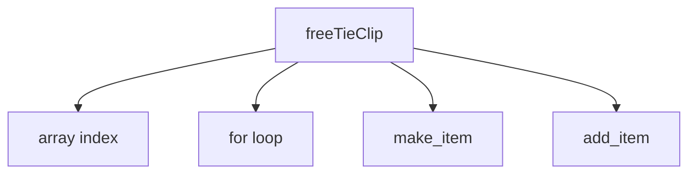

# 《簡約的軟體開發思維：用 Functional Programming 重構程式》CH8 ~ CH9

## 目錄

## 章節回顧：防禦式複製、不可變性

- 寫入時複製：資料可控時，效率高
  - 淺拷貝
  - 深拷貝
- 防禦式複製：資料進入不可預期、或是不受信任的環境時，能有效保護資料不被改變。

## Ch8: 分層設計(1)

- 軟體設計的的實用定義
- 了解分層設計的概念和用法
- 介紹分層架構的四大原則
- 了結如何透過『涵式截取』 讓程式碼更直觀

分層設計的『輸入』

- 程式碼長度
- 複雜度
- 細節程度
- 程式碼呼叫

分成設計的『輸出』

- 哪些地方需要更新韓式
- 移動程式碼的位置

---

底層運作需要的函式

呼叫圖

## Ch9: 分層設計(2)
