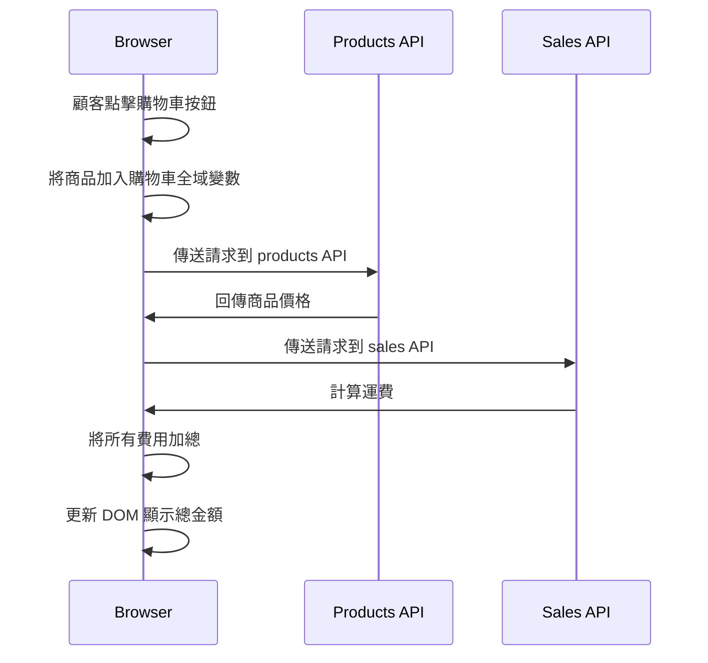

# 《簡約的軟體開發思維：用 Functional Programming 重構程式》CH15

## 目錄

- [Ch15. 解析時間線](#ch15-解析時間線)

---

## Ch15. 解析時間線

> 時間線：代表著會牽連到一系列的 Actions，而這些 Actions 會在不同的時間點被執行。



### 如何畫出時間線

1. 若兩個 Actions 有固定先後順序，則將他們畫在同一條時間線上

2. 若兩 Actions 可同時發生或不虛遵循特定順序，則他們屬於不同時間線。

### 不同程式語言採用不同執行緒

- 多執行緒

Java、Python、C#、C++、Go 等都採用多執行緒，且每個執行緒都有自己的堆疊，因次噓要藉由 lock 來避免 race condition。

<details>
<summary>多執行緒</summary>

```kotlin
import java.util.concurrent.locks.ReentrantLock
import kotlin.concurrent.withLock

fun main() {
    // 共享資源：計數器
    var counter = 0

    // 不使用鎖的情況
    runExperiment(lock = null, label = "Without Lock") {
        // 每個執行緒將 counter +1, 1000 次
        counter++
    }

    // 使用 ReentrantLock 的情況
    val lock = ReentrantLock()
    runExperiment(lock, label = "With ReentrantLock") {
        // 使用 withLock 確保鎖釋放
        lock.withLock {
            counter++
        }
    }
}

/**
 * 執行一次實驗：啟動 100 個執行緒，每個執行緒執行 1_000 次 action
 * lock 為 null 表示不加鎖
 */
fun runExperiment(
    lock: ReentrantLock?,
    label: String,
    action: () -> Unit
) {
    // 重置計數器
    var counter = 0
    val threads = List(100) {
        Thread {
            repeat(1_000) {
                if (lock == null) {
                    // 不加鎖直接執行
                    counter++
                } else {
                    // 已在 action 中加鎖
                    action()
                }
            }
        }
    }

    threads.forEach(Thread::start)
    threads.forEach(Thread::join)

    println("$label -> Expected: 100000, Actual: $counter")
}
```

</details>

### 分散式系統：設計時間線的原則

1. 時間線數量越少越好
2. 時間線上的步驟越少越好
3. 資源共享越少越好
4. 協調有共享資源的時間線
5. 更改程式的時間模型
