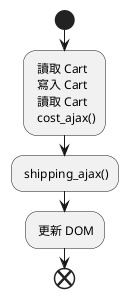

# 《簡約的軟體開發思維：用 Functional Programming 重構程式》CH16 ~ CH17

## 目錄

- [上週回顧](#上週回顧)
- [Ch16. 多條時間線共享資源](#ch16-多條時間線共享資源)
- [Ch17. 協調時間線](#ch17-協調時間線)

---

## 上週回顧

### 時間線的設計原則

1. 時間線數量越少越好
2. 時間線上的步驟越少越好
3. 資源共享越少越好
4. 協調有共享資源的時間線
5. 更改程式的時間模型

## Ch16. 多條時間線共享資源

> Concurrency primitives：指的是處理併發操作的基本工具

### 案例：購物車誤植

> 購物車誤植：購物車的總金額計算錯誤，導致購物車的總金額不正確

Resource: https://livebook.manning.com/book/grokking-simplicity/chapter-16/33

### 章節提問

1. 當有多條時間線時，謝列哪些資源的共享可能會導致問題？

- 全域變數
- 文件物件模型（DOM）
- Calculation 函式
- 區域變數
- 不可變的數值
- 資料庫
- API 呼叫

2. 什麼是 並行語言（Concurrency primitives）？

---

## Ch17. 協調時間線

先前的流程圖



> 這邊要講重構的流程

```js
function add_item_to_cart(item) {
  cart = add_item(cart, item);
  calc_cart_total(cart, update_total_dom);
}
function calc_cart_total(cart, callback) {
  var total = 0;
  cost_ajax(cart, function (cost) {
    total += cost;
    shipping_ajax(cart, function (shipping) {
      total += shipping;
      callback(total);
    });
  });
}
```

### 讓點擊處理器就能將商品加入佇列

```js
function add_item_to_cart(item) {
  cart = add_item(cart, item);
  calc_cart_total(cart, update_total_dom);
}

function calc_cart_total(cart, callback) {
  var total = 0;
  cost_ajax(cart, function (cost) {
    total += cost;
    shipping_ajax(cart, function (shipping) {
      total += shipping;
      callback(total);
    });
  });
}

var queue_items = [];

function update_total_queue(total) {
  queue_items.push(total);
}
```

### 從佇列前端取出處理的項目
